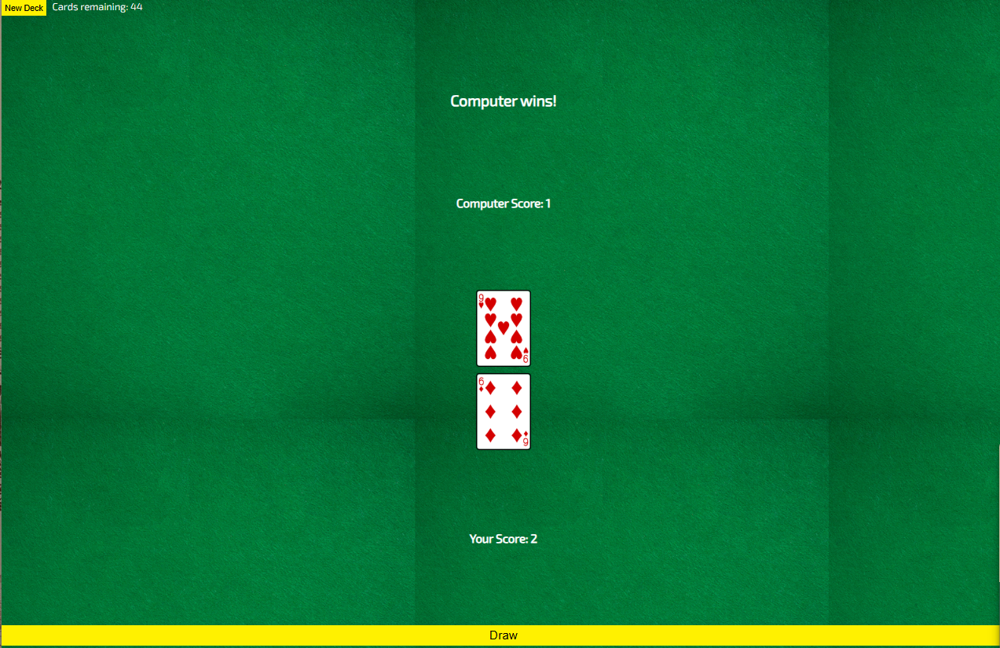
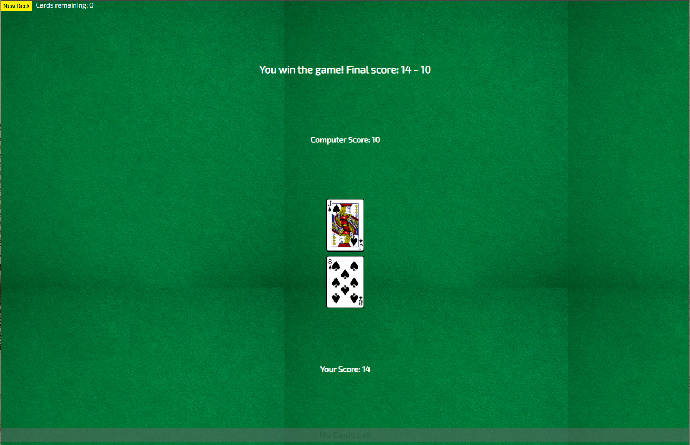

# War Card Game

A web-based implementation of the classic card game "War" built with vanilla JavaScript, HTML, and CSS. Challenge the computer in this simple yet engaging card game where the highest card wins!

## 🎮 Live Demo

**Play the game:** [https://kvothe1387.github.io/War-asyncJS/](https://kvothe1387.github.io/War-asyncJS/)

## 📸 Screenshots

### Game Interface

*The main game interface showing the card slots, scores, and draw button*

### Gameplay in Action

*Example of gameplay with cards drawn and winner determined*

## 🎯 How to Play

1. Click **"New Deck"** to shuffle a fresh deck of 52 cards
2. Click **"Draw"** to draw two cards - one for you and one for the computer
3. The player with the higher card wins the round and gets a point
4. Continue drawing until all cards are used
5. The player with the most points at the end wins the game!

### Card Values
- Number cards (2-10): Face value
- Jack: 11
- Queen: 12
- King: 13
- Ace: 14 (highest)

## 🚀 Features

- **Async API Integration**: Uses the Deck of Cards API for authentic card dealing
- **Real-time Scoring**: Track your score vs the computer throughout the game
- **Card Counter**: See how many cards remain in the deck
- **Game State Management**: Automatic game end detection and winner announcement
- **Responsive Design**: Clean, card table-themed interface
- **Error Handling**: Graceful handling of network issues

## 🛠️ Technologies Used

- **HTML5**: Structure and semantic markup
- **CSS3**: Styling with custom card table background and responsive layout
- **Vanilla JavaScript**: Game logic and async API calls
- **Deck of Cards API**: External API for card deck management
- **Google Fonts**: Exo 2 font family for clean typography

## 📁 Project Structure

```
├── index.html          # Main HTML structure
├── index.css           # Styles and layout
├── index.js            # Game logic and API integration
└── README.md           # Project documentation
```

## 🔧 Installation & Setup

1. Clone the repository:
   ```bash
   git clone https://github.com/kvothe1387/War-asyncJS.git
   ```

2. Navigate to the project directory:
   ```bash
   cd War-asyncJS
   ```

3. Open `index.html` in your web browser or serve it using a local server:
   ```bash
   # Using Python 3
   python -m http.server 3000
   
   # Using Node.js (with live-server)
   npx live-server
   ```

4. Visit `http://localhost:3000` (or your chosen port) to play the game

## 🎨 Game Features

### Visual Elements
- Card table background for authentic casino feel
- Yellow action buttons with hover effects
- Clean card display slots with border styling
- Real-time score updates
- Responsive layout that works on different screen sizes

### Game Logic
- Proper card value comparison including face cards and Aces
- Automatic winner determination for each round
- End game detection when fewer than 2 cards remain
- Score tracking throughout the entire game
- Button state management (disabled when no cards left)

## 🔄 API Integration

The game uses the [Deck of Cards API](https://deckofcardsapi.com/) for:
- Creating and shuffling new decks
- Drawing cards with authentic card images
- Tracking remaining cards in the deck

## 🤝 Contributing

Feel free to fork this project and submit pull requests for any improvements:

1. Fork the repository
2. Create a feature branch (`git checkout -b feature/new-feature`)
3. Commit your changes (`git commit -am 'Add new feature'`)
4. Push to the branch (`git push origin feature/new-feature`)
5. Create a Pull Request

## 📄 License

This project is open source and available under the [MIT License](LICENSE).

## 🎯 Future Enhancements

- [ ] Add animation effects for card dealing
- [ ] Implement "War" scenario handling (when cards tie)
- [ ] Add sound effects
- [ ] Create difficulty levels
- [ ] Add game statistics tracking
- [ ] Mobile touch optimizations

## 👨‍💻 Author

- GitHub: [David McCullough](https://github.com/kvothe1387)
- LinkedIn: [David McCullough](https://www.linkedin.com/in/davidmcc-webdev/)
- Portfolio: [My Portfolio](https://davidmcc.netlify.app/)

---

Built with ❤️ using vanilla JavaScript and the Deck of Cards API